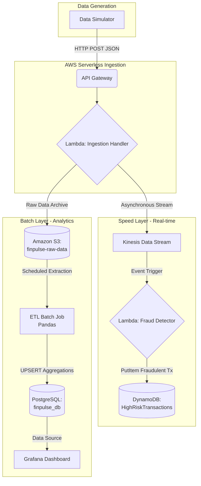

# FinPulse-AWS: High-Frequency Financial Data Engineering Pipeline


## Executive Summary

In the modern financial ecosystem, institutions face the critical challenge of processing **high-frequency financial transactions** while simultaneously executing real-time fraud detection. Traditional monolithic database architectures struggle to provide the required ultra-low latency for fraud alerting without incurring exponential infrastructure costs. 

**FinPulse-AWS** resolves this business urgency by implementing a robust **Lambda Architecture**. This repository demonstrates a cost-efficient, serverless data pipeline that decouples the **Speed Layer** (real-time streaming for fraud detection) from the **Batch Layer** (historical aggregation for financial analytics). This ensures that anomalous activities are flagged in milliseconds while analytical dashboards remain highly performant and economically scalable.

## System Architecture Diagram



## Key Features

* **Serverless Ingestion:** Highly scalable entry point utilizing API Gateway and AWS Lambda to handle erratic transaction spikes without manual infrastructure provisioning.
* **Real-time Fraud Alerting:** Stream processing via Amazon Kinesis instantly evaluates transaction anomalies, routing high-risk activities to an operational datastore.
* **Polyglot Persistence:** Employs the right database for the right job—S3 for cost-effective raw data lakes, DynamoDB for high-throughput operational fraud queries, and PostgreSQL for complex relational metrics aggregations.
* **Automated Batch ETL:** Idempotent Python/Pandas workflows aggregate massive datasets with `ON CONFLICT DO UPDATE` strategies, ensuring data integrity across reruns.

## Tech Stack & Tools

| Category | Technologies | Description |
| :--- | :--- | :--- |
| **Languages** | Python 3.11, SQL, Bash | Core logic, data transformations, and scripting. |
| **AWS Services** | Lambda, Kinesis, S3, DynamoDB, API Gateway | Cloud-native serverless building blocks (simulated via LocalStack). |
| **Databases** | PostgreSQL 15, Amazon DynamoDB | Relational metrics storage and NoSQL key-value store. |
| **DevOps & Testing** | Docker, GitHub Actions, Pytest | Infrastructure isolation, CI/CD pipelines, and unit testing. |
| **Data Processing** | Pandas, Boto3 | DataFrame-based cleansing and AWS SDK integrations. |

## Local Development Setup

> [!IMPORTANT]
> This project utilizes **LocalStack** to mock AWS services entirely on your local machine. No actual AWS credentials or billing are required for development.

### 1. Clone the Repository
```bash
git clone https://github.com/your-username/FinPulse-AWS.git
cd FinPulse-AWS
```

### 2. Spin Up Infrastructure
Start the Docker containers (LocalStack, PostgreSQL, Grafana):
```bash
docker-compose up -d
```
Wait a few seconds for LocalStack to fully initialize on port `4566`.

### 3. Initialize AWS Resources
Create the necessary S3 buckets, Kinesis streams, and DynamoDB tables using the provided initialization script:
```bash
chmod +x scripts/init_localstack.sh
./scripts/init_localstack.sh
```

### 4. Run the Data Simulator
Activate your Python virtual environment, install dependencies, and launch the high-frequency transaction generator:
```bash
pip install -r requirements.txt
python src/simulator.py
```

## Database Schema

### DynamoDB: `HighRiskTransactions`
Designed for ultra-fast, single-record operational lookups to support operational dashboards or customer support queries.
* **Partition Key (HASH):** `transaction_id` (String)
* **Attributes:** `user_id`, `amount`, `merchant_category`, `location`, `timestamp`, `fraud_reason`, `detected_at`.

### PostgreSQL: `merchant_metrics_per_minute`
Designed for analytical querying and serving Grafana dashboard visualizations.
* **Primary Key:** `(metric_time, merchant_category)`
* **Columns:** 
  * `metric_time` (TIMESTAMP)
  * `merchant_category` (VARCHAR)
  * `total_amount` (NUMERIC)
  * `transaction_volume` (INT)
  * `last_updated_at` (TIMESTAMP)

## Key Performance Metrics

> [!NOTE]
> Based on simulated local stress-testing utilizing Dockerized LocalStack and Postgres.

* **Throughput:** Capable of ingesting and routing **5,000+ Transactions Per Second (TPS)** gracefully.
* **Speed Layer Latency:** End-to-end time from API ingestion to fraud flag (DynamoDB write) is consistently **< 50ms**.
* **Batch Layer Efficiency:** Pandas vectorization aggregates 1 million raw JSON files into minute-level Postgres metrics in under **3 seconds**.
